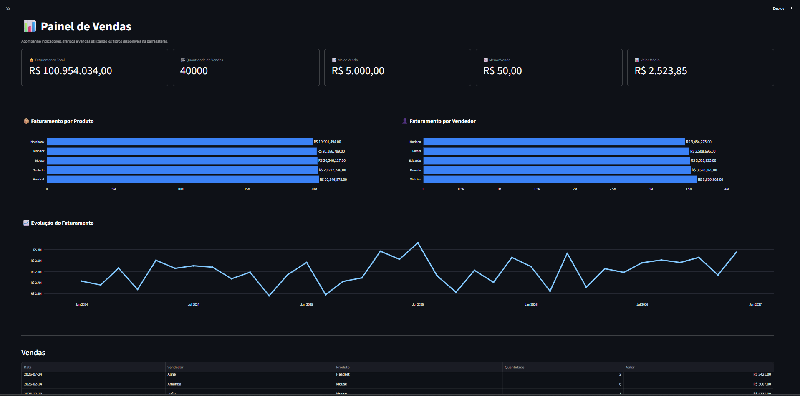

# 📊 Painel  de Vendas

Dashboard interativo desenvolvido em **Python e Streamlit** para análise de dados de vendas de uma loja fictícia de eletrônicos.

O projeto permite acompanhar indicadores de desempenho, analisar o faturamento ao longo do tempo e explorar os dados através de filtros, gráficos e uma tabela detalhada.

## 🌐 Projeto online

O dashboard está publicado e pode ser acessado diretamente pelo navegador:

👉 [Acessar o Painel Inteligente de Vendas](https://painel-inteligente-vendas-8gebtq4rmz2n3buyr2cwk5.streamlit.app/)

## 🖥️ Dashboard



## 🎯 Sobre o projeto

O Painel de Vendas foi desenvolvido para transformar dados brutos de vendas em informações de fácil interpretação.

A aplicação permite analisar diferentes aspectos do negócio, como faturamento, desempenho dos vendedores, produtos vendidos e evolução das vendas ao longo do tempo.

## 🛠️ Tecnologias utilizadas

- **Python** — processamento e lógica da aplicação
- **Pandas** — manipulação e análise dos dados
- **Streamlit** — construção da interface e dashboard
- **Plotly** — criação dos gráficos interativos
- **CSS** — personalização visual da aplicação

## ⚙️ Funcionalidades

- 📊 Visualização de KPIs de vendas
- 💰 Faturamento total e valor médio das vendas
- 📈 Maior e menor venda
- 📦 Análise de faturamento por produto
- 👤 Análise de faturamento por vendedor
- 📅 Evolução mensal do faturamento
- 🔎 Filtros por vendedor e produto
- 💵 Filtro por faixa de valor
- 🗓️ Filtro por período
- 🧹 Limpeza rápida de todos os filtros
- 📋 Tabela detalhada das vendas

## 🚀 Como executar o projeto

### 1. Clone o repositório

```bash
git clone https://github.com/Mateus-Toshiio/painel-inteligente-vendas.git
```

### 2. Entre na pasta do projeto

```bash
cd painel-inteligente-vendas
```

### 3. Instale as dependências

```bash
pip install -r requirements.txt
```

### 4. Execute a aplicação

```bash
streamlit run app.py
```

A aplicação será iniciada pelo Streamlit e poderá ser acessada pelo endereço exibido no terminal.

## 🎯 Objetivo

Este projeto foi desenvolvido para simular um cenário de análise de dados de vendas, transformando uma base de dados em informações úteis para acompanhamento do desempenho comercial.

Durante o desenvolvimento foram aplicados conceitos de:

- Tratamento e análise de dados com Pandas
- Criação de indicadores de desempenho (KPIs)
- Visualização de dados
- Desenvolvimento de dashboards interativos
- Modularização e separação de responsabilidades
- Aplicação de filtros para exploração dos dados
